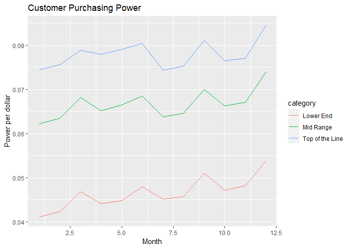

# Laptop Sales

Uses LaptopSales.csv data to answer the question: How did the retail price of a laptop change over time?

Data is preprocessed using Python to categorize each laptop as "Lower End", "Mid Range", or "Top of the Line", based on the components it contains. e.g., hard drive size, amount of RAM, battery life, etc.

# R Code for Plots
`library(ggplot2)`

`df <- read.csv("LaptopSalesCategorized.csv", header=FALSE, stringsAsFactors=TRUE)`

`names(df) <- c("month", "price", "power", "power.min", "power.max", "category", "ppd")`

`df$mf <- as.factor(df$month)`

The code below plots the average price per laptop category month-to-month as a line graph.

`avg.price <- aggregate(df$price, list(df$month, df$category), FUN=mean)`

`names(avg.price) <- c("month", "category", "price")`

`p1 <- ggplot(data=avg.price, aes(x=month, y=price, group=category)) + geom_line() + labs(title="Retail Price of Laptops", x ="Month", y = "Retail price")`

The code below plots the average purchasing power of the customer month-to-month as a line graph. That is, how much extra laptop power does the customer get for every dollar spent?

`avg.ppd <- aggregate(df$ppd, list(df$month, df$category), FUN=mean)`

`names(avg.ppd) <- c("month", "category", "ppd")`

`p2 <- ggplot(data=avg.ppd, aes(x=month, y=ppd, group=category)) + geom_line() + labs(title="Customer Purchasing Power", x ="Month", y = "Power per dollar")`

The code below displays the summary statistics for each category of laptop, each month, as a group of boxplots.

`p3 <- ggplot(df, aes(x=mf, y=price, fill=category)) + geom_boxplot() + labs(title="Retail Price of a Laptop (2008)", x ="Month", y = "Retail price")`

